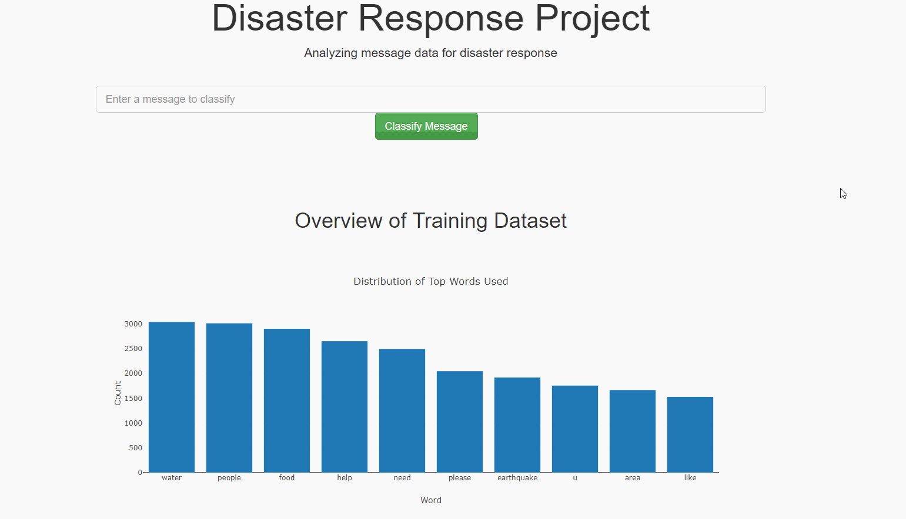

# disaster_response_pipeline



### Table of Contents
1. [Project Description](#Project)
2. [Installation](#installation)
3. [File Description](#files)
5. [Licensing, Authors, and Acknowledgements](#licensing)

## Project Description<a name="Project"></a>
This pipeline uses data obtained from [FigureEight](https://www.figure-eight.com/)

The disaster data is analyzed to build a model for an API that classifies disaster messages
and the end product is a webapp to be used by users to submit messages.

The goal is to have the messages classified and sent to the appropriate disaster relief agency.

The webapp allows an emergency worker to submit a message and get classification results in 36
different categories, and will also provide data visualizations/overview.

The project is made up of:
 - ETL pipeline: consisting of extracting the data from 2 csv files, then transforming 
   and cleaning it it. Afterwards, the data is loaded into a SQLite database.
 - ML pipeline: consisting of loading data from the SQLite database, and building a model.
 - Flask Webapp: Provides a way for an emergency worker to input a message as well as look
   at a data overview.


## Installation and Running<a name="installation"></a>
- The requirements can be found in the [requirements.txt](requirements.txt) file.

- That file allows you to pip install all the necessary dependencies by running:
    `pip install -r requirements.txt` in your shell.

- Libraries:
   - certifi==2019.6.16
   - joblib==0.13.2
   - nltk==3.4.4
   - numpy==1.17.0
   - pandas==0.25.0
   - python-dateutil==2.8.0
   - pytz==2019.1
   - scikit-learn==0.21.3
   - scipy==1.3.0
   - six==1.12.0
   - sklearn==0.0
   - SQLAlchemy==1.3.6
   - wincertstore==0.2`

- To run the the program, you need to run 3 files:
  1. `python process_data.py disaster_messages.csv disaster_categories.csv DisasterResponse`
  2. `python train_classifier.py ../data/DisasterResponse.db model.pkl`
  3. `python run.py`

- The webapp would then be available in your browser at http://localhost:3001


## File Descriptions <a name="files"></a>
```
│
├───app: webapp folder
│   │   run.py: creates the webapp and runs it at localhost
│   │
│   └───templates: contains the html and javascript code
│           go.html: handles user queries
│           master.html: front page
│
├───data
│       DisasterResponse.db: database containing the clean and transformed data
│       disaster_categories.csv: CSV file containing all the categories for a certain message
│       disaster_messages.csv: CSV file containing the message, and its genre
│       process_data.py: ETL pipeline
│
└───models
        model.pkl: pickel file containing the ML model and top common words extracted from dataset
        train_classifier.py: ML pipeline
```
## Licensing, Authors, Acknowledgements<a name="licensing"></a>
Credit to the Udacity lectures for some of the coding and visualization ideas.
